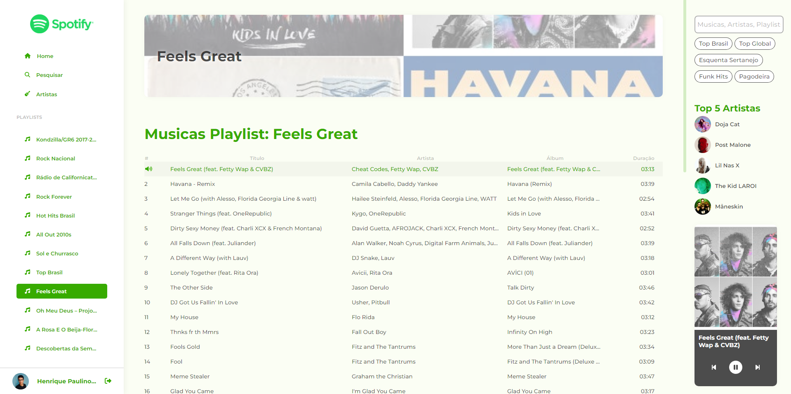

# SpotifyRedesignAngular

O projeto foi gerado com [Angular CLI](https://github.com/angular/angular-cli) versão 15.1.6.
O desenvolvimento do projeto foi baseado no tutorial do canal [Cristian William Dev](https://www.youtube.com/playlist?list=PLMFE0Mu3BVy63bmSR92QbTR_rU576VOxg). Mas sigo trabalhando no projeto para adicionar funcionalidades e melhorar o código.

A imagem abaixo mostra a tela principal do projeto.

## Funcionalidades

A aplicação consiste em um redesign do Spotify, onde é possível realizar o login com a conta do Spotify, visualizar suas playlists, músicas e artistas favoritos, além de possuir um player que controla qual música está tocando.

## Instruções para rodar o projeto

1. Clone o repositório
2. Instale as dependências com o comando `npm install`
3. Gere uma aplicação no site [Spotify Developer](https://developer.spotify.com/dashboard/)
4. Coloque o ClientID no arquivo `src/environments/environment.ts`
5. Rode o projeto com o comando `ng serve`
6. Acesse o endereço `http://localhost:4200/`
